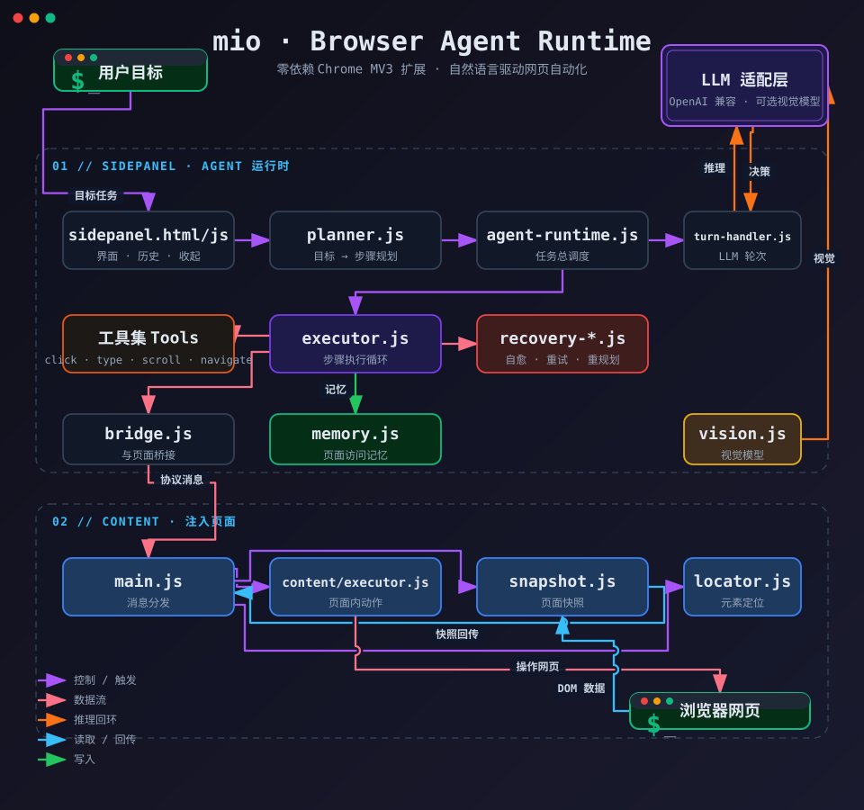

# mio 🐾

一个自然语言驱动的浏览器 Agent（Chrome 扩展）。告诉它你想做什么，mio 会像幽灵一样在网页上替你点击、输入、滚动、导航、提取内容——就像给浏览器雇了个会自己干活的助手。

**零依赖 · 本地运行 · 免费开源** —— 不需要 Node、Python 或任何环境，一个 Chrome 扩展搞定；LLM 用你自己的 API Key（甚至可以接本地模型），网页数据不出你的电脑。

## 🚀 2 分钟开始

1. 下载 [release 里的 zip](https://github.com/mldlbs/mio-browser-agent/releases) 并解压，或 `git clone` 本仓库
2. 打开 `chrome://extensions`，右上角开启「开发者模式」
3. 点击「加载已解压的扩展程序」，选择含 `manifest.json` 的目录
4. 点工具栏的 mio 图标打开侧边面板，在「设置」填好你的 LLM（见下）
5. 输入目标，例如 `在搜索框输入 hello 并点击提交按钮`，点「开始任务」

> 嫌麻烦？直接下载 release 里的 `.crx` 签名包，双击即可安装（Chrome 会提示「未列入商店」，属正常，自签名扩展均如此）。

### 配置模型

在侧边面板「设置」中填写：

| 字段 | 说明 | 示例 |
| --- | --- | --- |
| Provider | 供应商标识 | `openai` |
| Model | 模型名 | `gpt-4o-mini` |
| Base URL | API 地址 | `https://api.openai.com/v1` |
| API Key | 密钥（明文存储于 `chrome.storage.local`，仅本机可见） | — |
| Max Steps | 单次任务最大步数 | `30` |

**数据不出门**：mio 只把你的 Key 存在本机 `chrome.storage`，网页内容直接发到你填写的 Base URL。想完全本地？把 Base URL 指向本地服务即可（如 `http://localhost:11434/v1` 接 Ollama，或任意 OpenAI 兼容的本地推理服务），无需任何改动。

## ✨ 特性

- **自然语言任务**：输入目标，mio 自动规划步骤并执行，例如「在搜索框输入 hello 并点击提交按钮」
- **内置工具集**：`click`、`type`、`scroll`、`navigate`、`wait`、`extract_text`、`paste`、`tab`、`read_captcha`
- **恢复引擎（Recovery Engine）**：动作失败时自动定位替代元素、回退重试、重新规划，而不是死磕到超时
- **自愈式执行**：同一网页访问 LLM 可以记忆和复用（memory），跨页面保持上下文（runtime protocol / turn handler）
- **幽灵主题 UI**：深靛底 + 雾紫配色的侧边面板，日志按类型着色，状态一目了然
- **纯零依赖**：不打包任何第三方库，全部手写 JS，可用 Node 直接跑单元测试

## 🏗️ 架构

<p align="center">
  
</p>

数据流：`planner.js` 规划 → `agent-runtime.js` 调度 `executor.js` 逐步骤执行 → `bridge.js` 通知 `content/main.js` 在页面内动作 → 快照回传 → `turn-handler.js` 组装新一轮 LLM 请求 → 直至任务完成或恢复引擎接管。

## 📖 使用

### 运行任务

1. 在「任务目标」输入框描述目标，例如：`在搜索框输入 hello 并点击提交按钮`
2. 点击「开始任务」
3. 观察右侧日志流：`plan`（规划）→ `step`（执行）→ `tool`（工具调用）→ `finish`（完成）

任务进行中可随时「停止」。

## 🧪 测试

零依赖，有两条自动路径：

**单测**（快，覆盖核心逻辑）：

```bash
node tests/test_agent.js
```

用例覆盖：快照构建、元素定位回退、工具注册、规划器、恢复引擎（重试/替代元素/重新规划）、运行时协议与 LLM 动作解码。

**浏览器集成测试**（自动拉起 headless Chrome，在真实 DOM 上验证 content 逻辑）：

```bash
node tests/cdp/run-all.js
```

依次运行：CDP 冒烟探针 → 真实 DOM 断言（snapshot/locator/executor 在 test-page.html 上执行）→ 扩展注入探测。

说明：
- 浏览器测试需本机安装 Chrome（或设置 `CHROME_PATH` 环境变量指向 chrome.exe）
- 扩展的 content script 注入在 CDP 自动化 + 临时 profile 下暂不受支持（Chrome 已知限制），该 suite 会打印原因并优雅跳过（退出码 0）
- CI（GitHub Actions）会自动跑这两条路径，见 `.github/workflows/test.yml`（已实测通过：unit + browser 双 job 全绿）

浏览器内人工回归（真机端到端）：打开 `tests/test-page.html`，在侧边面板执行目标任务「在搜索框输入 hello 并点击登录按钮，最后提取页面文字」。已实测通过：规划出 3 步 → 输入 hello → 点击登录（计数 +1）→ extract_text 返回页面文字（含 `=== ALL PASS ===`），recoveries 0 / replans 0。

## 📄 License

[MIT](LICENSE)
